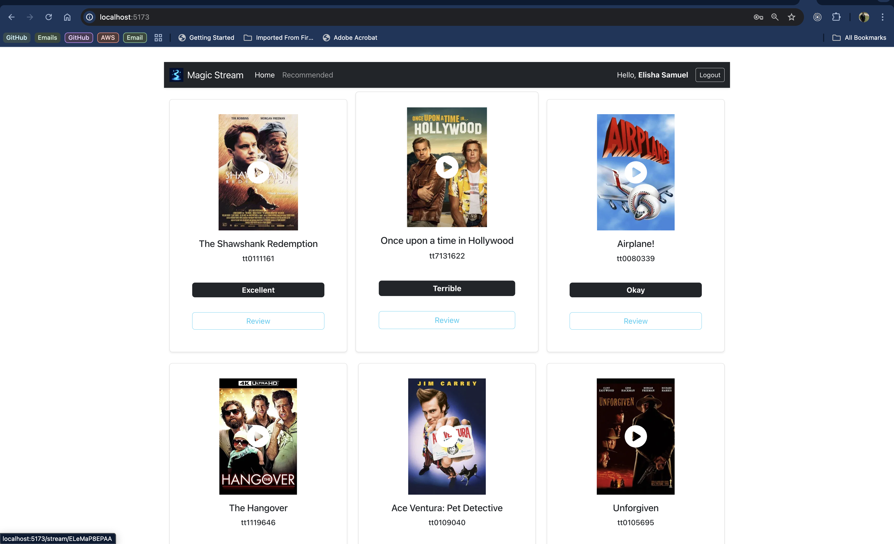

# MagicStreamMovies

Full-stack movie streaming and recommendation app. The backend is built with Go (Gin) and MongoDB, issuing JWT access/refresh tokens and performing basic content analysis for admin reviews using OpenAI. The frontend is a React (Vite) app that consumes the API, handling authentication and rendering movies, recommendations, and streaming pages.

## Preview



## Monorepo Structure
- client/ — React + Vite frontend
- server/ — Go + Gin + MongoDB backend


## Tech Stack
- Backend: Go 1.25, Gin, MongoDB, JWT (golang-jwt), CORS, dotenv
- AI: OpenAI (via langchaingo)
- Frontend: React 19, Vite, React Router, Axios, Bootstrap


## Features
- User registration and login with server-side validation
- JWT-based authentication with access and refresh tokens
- CORS with configurable allowed origins
- Protected API routes for movie details, recommendations, and admin review updates
- Admin review sentiment/ranking inference powered by OpenAI
- React client with route protection, login/registration, and basic UI


## Prerequisites
- Go 1.25+
- Node.js 18+
- MongoDB (local or hosted)
- OpenAI API key (for admin review ranking; optional if you won’t use the ranking feature)


## Backend Setup (server)
1) Create a server/.env file:

```
# Mongo
MONGODB_URI=mongodb://localhost:27017
DATABASE_NAME=magic_stream

# JWT secrets (generate secure random strings)
SECRET_KEY=replace-with-strong-secret
SECRET_REFRESH_KEY=replace-with-strong-refresh-secret

# CORS
ALLOWED_ORIGINS=http://localhost:5173

# OpenAI for admin review ranking (optional)
OPENAI_API_KEY=sk-...
# Template used to ask the LLM to pick exactly one classification from the provided set
# Must include the "{rankings}" placeholder which is dynamically replaced from DB values
BASE_PROMPT_TEMPLATE=Given the following set of ranking categories: {rankings}. Read the admin review and respond with exactly one category from the list that best matches the sentiment. Do not include any extra text. Your response must be one of: {rankings}.

# Recommendations
RECOMMENDED_MOVIE_LIMIT=5
```

2) Install dependencies and run the API:

```
cd server
go run main.go
```

The API starts on http://localhost:8080.


### MongoDB Collections (expected)
- users
- movies
- genres
- rankings

Minimal example documents to bootstrap:

- genres
```
{ "genre_id": 1, "genre_name": "Action" }
{ "genre_id": 2, "genre_name": "Drama" }
{ "genre_id": 3, "genre_name": "Comedy" }
```

- rankings
```
{ "ranking_value": 1, "ranking_name": "MUST_WATCH" }
{ "ranking_value": 2, "ranking_name": "RECOMMENDED" }
{ "ranking_value": 3, "ranking_name": "AVERAGE" }
{ "ranking_value": 4, "ranking_name": "SKIP" }
# reserve 999 for any sentinel if you use one in code/DB seeding logic
```

- movies
```
{
  "imdb_id": "tt1234567",
  "title": "Example Movie",
  "poster_path": "https://example.com/poster.jpg",
  "youtube_id": "dQw4w9WgXcQ",
  "genre": [ { "genre_id": 1, "genre_name": "Action" } ],
  "admin_review": "Explosive action with tight pacing.",
  "ranking": { "ranking_value": 2, "ranking_name": "RECOMMENDED" }
}
```


## Frontend Setup (client)
1) Create client/.env with API base URL:

```
VITE_API_BASE_URL=http://localhost:8080
```

2) Install dependencies and run the dev server:

```
cd client
npm install
npm run dev
```

The app starts on http://localhost:5173.


## API Reference
Base URL: http://localhost:8080

Note on auth: Protected routes require an Authorization header with a valid Bearer access token returned by the login endpoint. The server also sets httpOnly cookies for tokens, but the middleware currently validates the Authorization header token. If you rely on cookies, ensure your client attaches the Authorization header or adjust the middleware to read from cookies.


- GET /movies
  - Public. Returns all movies.

- GET /genres
  - Public. Returns available genres.

- POST /register
  - Public. Create a new user.
  - Body:
    {
      "first_name": "Jane",
      "last_name": "Doe",
      "email": "jane@example.com",
      "password": "secret123",
      "role": "USER",
      "favourite_genres": [{ "genre_id": 1, "genre_name": "Action" }]
    }

- POST /login
  - Public. Login and receive tokens; also sets httpOnly cookies.
  - Body:
    { "email": "jane@example.com", "password": "secret123" }
  - Response includes:
    {
      "user_id": "...",
      "first_name": "Jane",
      "last_name": "Doe",
      "email": "jane@example.com",
      "role": "USER",
      "token": "<access_token>",
      "refresh_token": "<refresh_token>",
      "favourite_genres": [ ... ]
    }

- POST /refresh
  - Public endpoint that uses the refresh_token cookie to rotate tokens and set new cookies.
  - Returns: { "message": "Tokens refreshed" }

- POST /logout
  - Public. Clears tokens for a user and clears cookies.
  - Body:
    { "user_id": "<id>" }

- GET /movies/:imdb_id
  - Protected. Returns a specific movie by imdb_id.
  - Headers: Authorization: Bearer <access_token>

- POST /movies
  - Protected. Add a new movie.
  - Headers: Authorization: Bearer <access_token>
  - Body (validated):
    {
      "imdb_id": "tt1234567",
      "title": "Example Movie",
      "poster_path": "https://example.com/poster.jpg",
      "youtube_id": "dQw4w9WgXcQ",
      "genre": [{ "genre_id": 1, "genre_name": "Action" }],
      "admin_review": "...",
      "ranking": { "ranking_value": 2, "ranking_name": "RECOMMENDED" }
    }

- PATCH /update-review/:imdb_id
  - Protected + Admin-only (role must be ADMIN).
  - Headers: Authorization: Bearer <access_token>
  - Body:
    { "admin_review": "Strong pacing and cinematography." }
  - Automatically updates ranking based on OpenAI classification and stored rankings.

- GET /recommended-movies
  - Protected. Returns movies recommended for the authenticated user, filtered by their favourite genres and ranking ordering.
  - Headers: Authorization: Bearer <access_token>


### Quick cURL examples
- Login and capture token:
```
curl -s -X POST http://localhost:8080/login \
  -H 'Content-Type: application/json' \
  -d '{"email":"jane@example.com","password":"secret123"}' | jq -r '.token'
```

- Get movies (public):
```
curl http://localhost:8080/movies
```

- Get a movie (protected):
```
TOKEN=... # paste token from login
curl http://localhost:8080/movies/tt1234567 -H "Authorization: Bearer $TOKEN"
```


## Frontend Notes
- Base API URL is read from VITE_API_BASE_URL
- Axios clients are configured with withCredentials: true
- The route guard component redirects unauthenticated users to /login


## Development Scripts
- client
  - npm run dev — start Vite dev server
  - npm run build — production build
  - npm run preview — preview built app
- server
  - go run main.go — start API in dev
  - go build — build binary


## Troubleshooting
- 401 on protected routes: Ensure the Authorization: Bearer <token> header is set. The middleware reads the access token from the header.
- Cookies not being sent in dev: The server sets cookies with Secure and SameSite=None which typically require HTTPS. For local development, prefer the Authorization header flow or adjust cookie/security settings accordingly.
- CORS errors: Set ALLOWED_ORIGINS in server/.env to your frontend origin (e.g., http://localhost:5173).
- MongoDB connection issues: Verify MONGODB_URI and DATABASE_NAME. Ensure MongoDB is running and accessible.
- OpenAI errors: Ensure OPENAI_API_KEY and BASE_PROMPT_TEMPLATE are set. The rankings collection must contain the categories used by the LLM.


## Project Structure (excerpt)
- client/
  - src/
    - api/ (axios configs)
    - components/ (Header, Home, Login, Register, Review, Recommended, StreamMovie)
    - context/ (AuthProvider)
    - hooks/ (useAuth, useAxiosPrivate)
- server/
  - controller/ (movie, user)
  - database/ (Mongo connection)
  - middleware/ (auth)
  - model/ (User, Movie, Genre, Ranking)
  - route/ (protected/unprotected)
  - util/ (token helpers)
